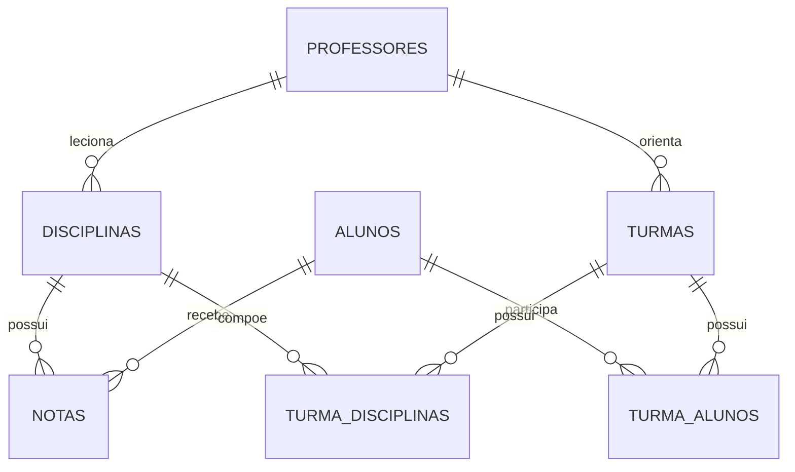

# Gerenciamento Escolar com SQLite

Projeto de banco de dados relacional desenvolvido para praticar os fundamentos de SQL e SQLite por meio da modelagem de um sistema de gerenciamento escolar.

O banco representa alunos, professores, disciplinas, turmas e notas, incluindo os relacionamentos necessários entre essas entidades.

## Objetivo

Aplicar na prática conceitos fundamentais de bancos de dados relacionais, como:

- criação de tabelas;
- definição de chaves primárias;
- criação de chaves estrangeiras;
- relacionamento entre tabelas;
- inserção e consulta de dados;
- filtros e ordenação de resultados;
- organização de um banco SQLite.

## Modelo relacional



## Estrutura do banco

| Tabela | Finalidade |
|---|---|
| `Alunos` | Armazena dados cadastrais dos alunos |
| `Professores` | Armazena dados dos professores |
| `Disciplinas` | Registra as disciplinas e o professor responsável |
| `Turmas` | Representa as turmas e seus professores orientadores |
| `Turma_Alunos` | Relaciona alunos e turmas |
| `Turma_Disciplinas` | Relaciona turmas e disciplinas |
| `Notas` | Registra avaliações dos alunos por disciplina |

## Tecnologias

- SQL
- SQLite
- Banco de dados relacional

## Estrutura do repositório

```text
school-management-sql/
├── database/
│   ├── schema.sql
│   ├── seed.sql
│   └── school_management.db
├── docs/
│   └── data_quality.md
├── queries/
│   ├── basic_queries.sql
│   └── validation.sql
├── .gitignore
└── README.md
```

## Como executar

### Opção 1 — usando o arquivo pronto

Abra:

```text
database/school_management.db
```

em uma ferramenta compatível com SQLite.

### Opção 2 — recriando o banco

Com o SQLite instalado:

```bash
sqlite3 school_management.db < database/schema.sql
sqlite3 school_management.db < database/seed.sql
```

Depois, execute as consultas disponíveis em:

```text
queries/basic_queries.sql
```

## Exemplos de consultas

Listar disciplinas com carga horária de 60 horas:

```sql
SELECT Nome_Disciplina, Carga_Horaria
FROM Disciplinas
WHERE Carga_Horaria = 60;
```

Listar notas iguais ou superiores a 7:

```sql
SELECT ID_Aluno, ID_Disciplina, valor_nota, Data_Avaliacao
FROM Notas
WHERE valor_nota >= 7
ORDER BY valor_nota DESC;
```

## Integridade dos dados

A cópia disponibilizada no repositório foi validada com `PRAGMA integrity_check` e
`PRAGMA foreign_key_check`.

Mais detalhes sobre a preparação dos dados estão em
[`docs/data_quality.md`](docs/data_quality.md).

## Contexto

Projeto desenvolvido após o curso **SQLite online: conhecendo instruções SQL**, da Alura, como prática dos primeiros conceitos de SQL e bancos de dados relacionais.

## Próximos passos

Este projeto representa a etapa inicial de aprendizado em SQL. Funcionalidades e consultas mais avançadas podem ser adicionadas conforme a evolução dos estudos, incluindo agregações, `JOIN`, subconsultas, views e transações.
